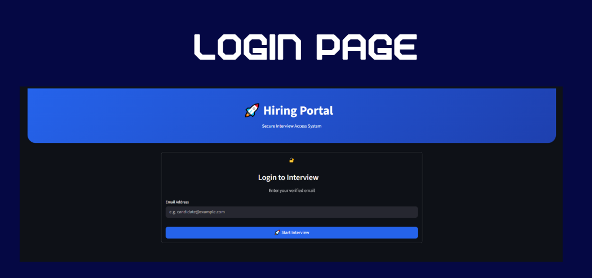
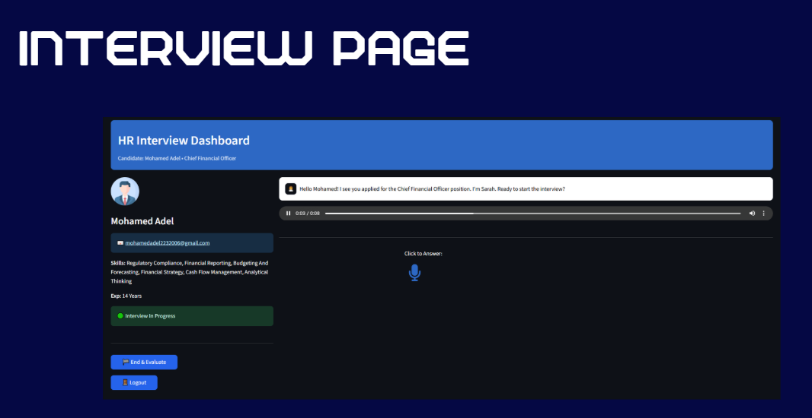
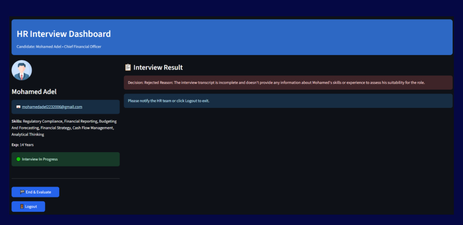

# 🗣️ AI Automated Interviewing Agent

## 📌 Project Overview
An intelligent, production-ready AI hiring portal built to conduct automated, real-time voice-driven technical interviews. The system simulates a human recruiter (Sarah) by providing a seamless, voice-to-voice interface that eliminates the need for typing, dynamically adapts questions based on candidate profiles, and generates instant hiring decisions.

## 📸 Application Interface

## 🛠️ Tech Stack
* **Frontend UI Framework:** Streamlit
* **LLM Engine:** Google Generative AI (gemini-2.0-flash / gemini-pro)
* **Vector Database:** Qdrant Cloud (Auth & Profiles)
* **Speech-to-Text (STT):** SpeechRecognition & Audio Recorder Streamlit
* **Text-to-Speech (TTS):** gTTS (Google Text-to-Speech)

## 🧠 Model Workflow
1. **Secure Database Login:** Authenticates candidates against a cloud-hosted Qdrant database (filtering for "interviewing" status) to fetch their skills and experience.
2. **Context-Aware Interviewer:** Initializes a chat session using Gemini injected with candidate context, strictly instructed to ask one short technical question at a time.
3. **Voice-to-Voice Interface:** Captures audio via Streamlit, transcribes it using SpeechRecognition, and synthesizes Sarah's responses using gTTS with auto-play.
4. **Automated Evaluation:** Once the interview is completed, a specialized prompt triggers the LLM to parse the entire transcript, outputting a data-driven hiring decision (Accepted / Rejected) backed by a concise technical reason.

	
